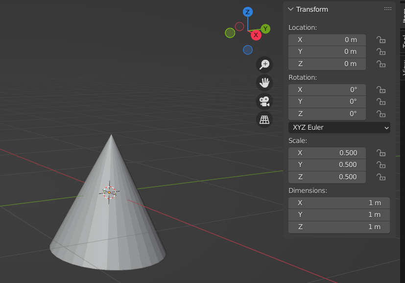
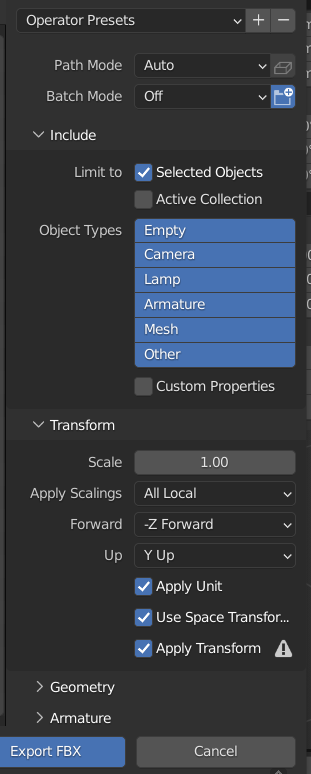
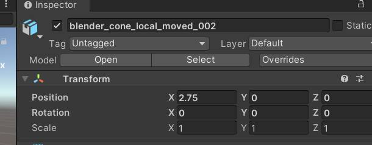

# Ejemplo Blender to Unity con scale factor

Este proyecto demuestra como configurar Blender 3.0 para importar a Unity (2020.3.14f1) con un scale factor de 1 a 1

Se utiliza un cono para verificar que la rotacion se importe correctamente.

## Crear cono en blender

Se agrega un cono a la escena, y se configura el Transform ajustando las dimensiones a 1 metro para cada eje, de la siguiente forma:

Puede observarse que la escala esta en 0.5 para todos los ejes, es importante aplicar las transformacinoes al modelo, para ello presionar Control+A y elegir Rotation and Scale:

Una vez aplicada la transformacion, necesitamos exportar el objeto a .FBX, seleccionamos el Cono en Scene collection y configuramos lo siguiente en la pantalla de Export:

Una vez configurado clickear Export FBX.

## Importar cono en unity
Listo, ahora arrastramos el archivo FBX a editor de unity y deberiamos verlo asi:

Si observamos el inspector del prefab, podemos ver que el Scale Factor esta en 1 (es decir, se mantiene el scale factor de la aplicacion de modelado 3d) y la conversion de unidades de 1 cm a 0.01m de Unity (es decir, 1 centimetro de unity)

Si arrastramos el Cono a la jerarquia de la escena, podemos ver que se mantiene la escala y la rotacion tal cual estaba en Blender:

